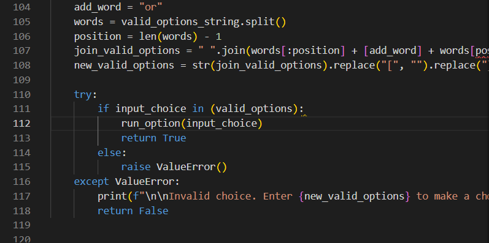

# **TRIVIA QUIZ**
The TRIVIA QUIZ is a quiz game. It is a Python terminal game running in the Code Institute mock terminal on Heroku. 

The TRIVIA QUIZ is for everyone who´d like to test their trivia knowledge and increase it in a fun way. The aim with the quiz is to increase the player´s knowledge in three differents subjects - science, movies and geography. The game can be played as many times as the player wants, making it possible for the user to really have a chance to learn.

You can find the site [here](LÄÄÄÄÄÄÄÄÄÄÄÄNK).

## **How to play**
First the player has to enter a valid username. Then the main quiz menu is displayed. Here the player can choose a category of quiz questions (science, movies or geography), to view the score board menu or to quit the game.

When the player chooses a quiz, the screen is cleared and the first question of that quiz is displayed. After entering a valid answer (1, 2 or 3) the user gets a message if the answer was correct or incorrect before the next question is displayed. When all questions in that quiz is answered the player is alerted and the reached score is saved. The player needs to press enter to get back to the quiz menu.

If the player chooses to view the score board menu it is taken to a new menu with options to view a score board (one for each quiz catagory) or to get back to the main quiz menu. 

If choosing to view a score board, the scores for the choosen quiz is showed in a table. The player can get back to the score board menu by pressing enter.

## **Features**

### **Existing features**

#### **Introduction**
Contains the game logo and a small introduction, so that it is clear to the player what kind of game it is about to play. It also askes the player for a username. The username is mandatory as it is required to be able to save and sort the player score in a score board. Being able to save the score is useful to the player as the player won´t have to keep track of the score itself. 

If a username isn´t entered, the player will be alerted by a message informing the player of what went wrong. This kind of message will also be alerted in all below cases: 
- if a whitespace is entered in the username
- if the username is less than 2 characters long
- if the username is more than 10 characters long
- if the username is already taken by another user

These limitations and messages are useful to the player as it ensures that their score is clearly visible in the score table and is not overwritten by another user's score. The messages are printed in red, to make them stand out and be eye-catching to the player.  

#### **Quiz menu**
After entering a valid username, the player is taken to the main quiz menu. This menu is very userful to the player as it allows the player to initiate a quiz but also quit the game (option "q") so that the player can end the game whenever it wants. A quiz is chosen by entering any of the valid choices "s" for science, "m" for movies or "g" for geography. The player is also informed of how its score is saved in the score board, which of course is important for the player to know about before playing. In the quiz menu the player can also choose to view the score board menu (option "v"). 

If the player enters a invalid choice the player will be alerted by a message informing the player of what went wrong. The message will be displayed each time the player enteres a invalid choice. This limitation and message is useful to the player as it ensures that they will end up where they want to end up when choosing a option in the menu. The messages are printed in red, to make them stand out and be eye-catching to the player. 

#### **The quizes - displaying questions**

VIlket värde har denna feature för användaren. Fokus på vad användaren vill åstadkomma, och varför mitt projekt är bästa projektet att åstadkomma detta.

You will need to explain what value each of the features provides for the user, focusing on who this website is for, what it is that they want to achieve and how your project is the best way to help them achieve these things.

#### **Score menu**

#### **Score table**

#### **Quit the game**
When the player has chosen to quit the game in the main quiz menu, the below information is shown in the terminal. This part of the game is only shown in a couple of seconds which is useful to the player as it allows it to be informed that the game is shutting down but at the same time dosen´t force the player to stay in the game longer than necessary.

### **Future features**
Expansion of the game:
- Add levels to each quiz - easy, medium, hard

## **Data model**
There are three quiz categories in the game. For each quiz category I used a list of nested lists to store the questions. Each nested list contains a question, three different answer options and the correct answer. The correct answer is always the last value of the list and is poped of the list each time list is displayed to the player. All of the question lists are located inside the `run_option()`-function. 

Each quiz category has a related score board. Each score board is a dictionary. All the dictionaries are nested inside the same list (called `score_boards`). Everytime the player has finished a quiz the reached score is entered into the dictionary related to that quiz together with the player username as a key:value-pair. The reason for coosing a dictonary was that I wanted to be able to sort the scores without loosing track of which player scored each specific score.
    
To be able to access the username in several functions without using a global variable, I used a small Player class to store it.

## **Testing**
Git was used for version control. Gitpod was used to write the code.

I used the `print()`-statement and [Python Tutor](https://pythontutor.com/visualize.html#mode=edit) to manually test the code through out the building process. Printing code to the terminal in Gitpod at serveral places in a code block made it easy to follow where the code didn´t behave as expected. Python Tutor added further possibilities to investigate where the error occurred in the code.

The project has been tested so that it works and looks good in the Code Institute Heroku terminal.

### **Validator testing**
I have validated my code with the [CI Python Linter](https://pep8ci.herokuapp.com/). I validated the code during the building process of the project. The test returned some errors:
- trailing whitespaces on several rows, which were solved simply by removing the whitespaces.
- blank lines containing whitespaces, also solved simply by removing the whitespaces.
- lines with more than 80 characters. To solve this I made sure all lines where less than 80 characters. For example, lines in the `validate_choice()`-function was to long. In that function the names of the arguments were a bit long. Changing to shorter names solved this error. In the `run_option()`-function, the the questions and the print messages to the user were to long. This was solved by placing them on two lines instead of one.

I had the above errors in mind when continuing building the project, to not cause them again. When the code was finished I tested it with CI Python Linter again. The deployed code returns no errors when validated.

### **Resolved problems**
When building the game there was problems with the variable storing the player scores. After finishing one quiz the saving of the score worked fine and the saved score was displayed in the score board. But when another quiz was finished and I tried to view the score board again a TypeError was raised in the terminal. When this problem occured the `score_board`-list consisted of three nested lists (one for each quiz) and in each nested list there was a list with information about the quiz and a dictionary to which the player score was added. It looked like this: 

The conclusion after a lot of manual testing was that the problem seemed to be that the nested lists in the `score_boards`-list contained both a list and a dictionary. The reason for using this syntax was so to be able to directly use the `score_board`-list to create tables for each score board. The list in each nested list, for example `["SCIENCE TRIVIA  ", "Player    ", "Score"]` was supposed to be used as the header in each table. But as this seemed to cause problems, and adding a header in this way is not necessary in order to display a table, the problem was solved by redesigned the `score_board`-variable to only contain nested dictionaries, like this:  

The header information for the tables was moved to the `print_score_board()`-function where the tables are created.

### **Bugs**
When validating the username, at first I forgot to handle blank spaces (which I didn´t want to be allowed in the username) in the `validate_username()`-function. To check for this I began by trying to add another if-statment checking if 'data == " "' but later found the 'isspace()'-method. I used this [geeksforgeeks page](https://www.geeksforgeeks.org/python-string-isspace-method/) to help me figure out that the username could be itered through to find spaces.

To display the questions in a quiz the `run_option()`-function in the `choose_option()`-function has to be called. When manually testing the program when building it, the questions in a quiz would not stop displaying after all six of them had been answered. The program was put through Python Tutor which showed that after the last question was answered the program went to the `validate_choice()`-function and ran the if-statment in it. Then I noticed that the `run_option()`-function was called from this function as well, causing the questions to display over and over. To solve this I just removed the `run_option()`-function in the `validate_choice()`-function. 

The first deployed version of the game didn´t look good after clearing the terminal window by calling the `clear_screen()`-function. I quickly realised that this was caused by the fact that some parts of the code printed more than 24 rows of code to the Code Institute mock terminal which is only 24 rows high. One example of this the score board tables, which were all printed at the same time in the first version. This caused the table being displayed first to be partly out of view when all tables had been printed, forcing the player to scroll up to the top of the "page" to be able to see it. To solve this the score board menu was added, along with the `print_score_board()`-function and `run_score_board()`-function, in order to display each score table individually.

When creating the quiz, at first I stored the username in a global variable. But this gave a warning in the Gitpod workspace which reminded me of that using global variables might not be best practise. To solve this I created a class called 'Player' and put the username variable inside it. 

No bugs have been idenitified in the deployed version.

## **Deployment**
You can find the link to the live site [here](LÄÄÄÄÄÄÄÄÄÄÄÄÄÄÄÄNK).

The site was deployed to Heroku with the following steps:

1. Log in to GitHub.
2. Find the right repository and open it with Gitpod.
3. Make sure you have removed any unused imported packages from your python code file and that you have uninstalled the packages. 
4. Make sure you have added \n to the end of all input()-methods in your code (otherwise the text will not show up in the terminal). For example `data = input("Please enter data here:\n")`.
5. Create a new file named "requirements.txt". In the file, create a list of all the dependencies that the project needs to run, so that they will be installed by Heroku. Create the list by typing `pip3 freeze > requirements.txt`, in the terminal and press enter. This updates the file with all the dependencies.  
6. Make sure you save all changes made in previous steps and commit and push to GitHub.
7. Log in to your Heroku account at their website. From your Heroku dashboard, create a new app by clicking the "New"-button on the right hand side and select the "Create new app"-option. If it´s the first time you create an app, there will be a "Create new add"-button in the middle of the page instead. This takes you to a new page where you name your app, choose a region and then click the "Create app"-button. 
8. In the app you created, you need to create an environment variable, called Config Var in Heroku. This is done under the "Settings"-tab in the top menu. Click the tab. On the settings page scroll down to the Config Vars-section and click the "Reveal Config Vars"-button.
6. In the input field "KEY", type in "PORT" (to name the Config Var). In the input field "VALUES" type in "8000". Then click the "Add"-button.
7. Scroll down to the "Buildpacks"-section and add two buildpacks by clicking the "Add buildpack"-button First select Python and click "Save changes". Then click the "Add buildpack"-button again, select nodejs and click "Save changes".
8. Now scroll back up to the top menu and click the "Deploy"-tab. Scroll to the "Deployment method"-sction and select GitHub. In the "Connect to Github"-section that shows up, click on "Connect to GitHub". When the connecting is done you will see a search bar where you can search for the repository name. Click on the "Connect"-button that shows up when Heroku has found your repository.  
9. Sroll further down and choose either to deploy automatically by clicking the "Enable Automatic Deploys" or deploy manually by clicking the "Deploy Branch"-button. When the deployment is finished you can go to the "Settings"-tab again and scroll down to the "Domains"-section where you can find the link to your deployed app.  

## **Credits**
I used [this Code Institute lesson example](https://learn.codeinstitute.net/courses/course-v1:CodeInstitute+LS101+2021_T1/courseware/293ee9d8ff3542d3b877137ed81b9a5b/c92755338ef548f28cc31a7c3d5bfb46/?child=first) to figure out how to build the try/except-statement in the `validate_username()`-function. I also used this [geeksforgeeks page](https://www.geeksforgeeks.org/password-validation-in-python/) to figure out how to return to the `get_username()`-function if invalid username was entered.

I used [the Love Sandwiches project](https://learn.codeinstitute.net/courses/course-v1:CodeInstitute+LS101+2021_T1/courseware/293ee9d8ff3542d3b877137ed81b9a5b/c92755338ef548f28cc31a7c3d5bfb46/?child=first) to figure out what to start with to build the game. 

[This geeksforgeeks.org page](https://www.geeksforgeeks.org/python-string-isspace-method/) was used to help me figure out how to check for blank spaces in the username, i.e. by using the isspace()-method and iterate through the username put into the `validate_username()`-function. 

In the `validate_choice()`-function, I wanted the message informing the player of invalid input to be clean and nice. Instead of showing the `valid_options`-list in the terminal when printing the message, for example `["s", "m", "g", "v"]`, I wanted it to look like this `'s', 'm', 'g', or 'v'`. In order to do this I used code from [this geeksforgeeks.org page](https://www.geeksforgeeks.org/python-add-phrase-in-middle-of-string/)(placed on line 127-131 in the program) to be able to insert an `or`-string into the list before printing the message. It was done by re-designing the list in three steps: (1) splitting it, (2) adding "or" to the second to last position and (3) putting it back together again. After this I also needed to remove the `[]` around the list and `,` between the options. To understand how to do this I used [this blog post](https://blog.finxter.com/how-to-print-a-list-without-brackets-and-commas-in-python/) to learn more about the `replace`-method for strings and how to use it to make a list look cleaner when printed.

I used [this askpython.com page](https://www.askpython.com/python-modules/tabulate-tables-in-python) and [this pypi.org page](https://pypi.org/project/tabulate/) to learn how to create simple tables with the tabulate package which resulted in this line of code to make the table look good: `table = tb(scores_as_list, headers="firstrow")`. 

When creating the `sort_score_board()`-function [this https://docs.python.org/](https://docs.python.org/3/howto/sorting.html) together with [this Programiz.com page](https://www.programiz.com/python-programming/methods/list/sort) was used to learn how to sort the score dictionaries in descending order, using the `sorted`-method together with the `reverse` parameter with a value of `True`. Code on line 169-174 in the `sort_score_board()`-function is taken from [this stackabuse.com page](https://stackabuse.com/how-to-sort-dictionary-by-value-in-python/). The code is used to loop through a dictionary of scores in the `score_boards`-list of dictionarys. The code has been adjusted to fit my program by changing variable names. 

The code on line 36 to clear the screen/user window is taken from [this Stackoverflow page](https://stackoverflow.com/questions/4810537/how-to-clear-the-screen-in-python).

[This](https://sports-hangman.herokuapp.com/) peer portfolio project inspired me to have different catagories of questions (i.e. different games).

The readme.md-files for the Code Institute scope project [showed here](https://learn.codeinstitute.net/courses/course-v1:CodeInstitute+PE_PAGPPF+2021_Q2/courseware/b3378fc1159e43e3b70916fdefdfae51/605f34e006594dc4ae19f5e60ec75e2e/) and the [Love Running website](https://github.com/Code-Institute-Solutions/readme-template) was used as inspiration for the content of the readme.md file for this project. 

The following external python libraries were used in this project:
- [tabulate](https://pypi.org/project/tabulate/) - to display each score board in a simple table.
- [colorama](https://pypi.org/project/colorama/) - to add some color to the project.

[This Askpython.com page](https://www.askpython.com/python/examples/print-colored-text-to-the-terminal-in-python) helped me understand how to use colorama.

The quiz questions were taken from these websites:
- science quiz: [Radiotimes.com](https://www.radiotimes.com/quizzes/pub-quiz-science/), [Greatwolf.com](https://www.greatwolf.com/blog/science-trivia-questions/), [Icebreakerideas.com](https://icebreakerideas.com/science-trivia/), [Triviawhizz.com](https://triviawhizz.com/trivia-questions/space), [Quiztriviagames.com](https://www.quiztriviagames.com/human-body-quiz/), [Usefultrivia.com](https://www.usefultrivia.com/science_trivia/animal_trivia_index.html)
- movie quiz: [Buzzfeed.com](https://www.buzzfeed.com/kellyrissman/movie-trivia-questions), [rd.com](https://www.rd.com/article/movie-trivia-facts/) 
- geography quiz: [Usefultrivia.com](https://www.usefultrivia.com/geography_trivia/)

[Tinypng.com](https://tinypng.com/) was used to compress the images in the readme.md file. 

## **Acknowledgements**
I would like to thank my mentor Antonio Rodriguez for guiding me when building this site, for example helping me with how to refactor repetative code and how to clear the screen/user window and delay the program at specific points in the game.